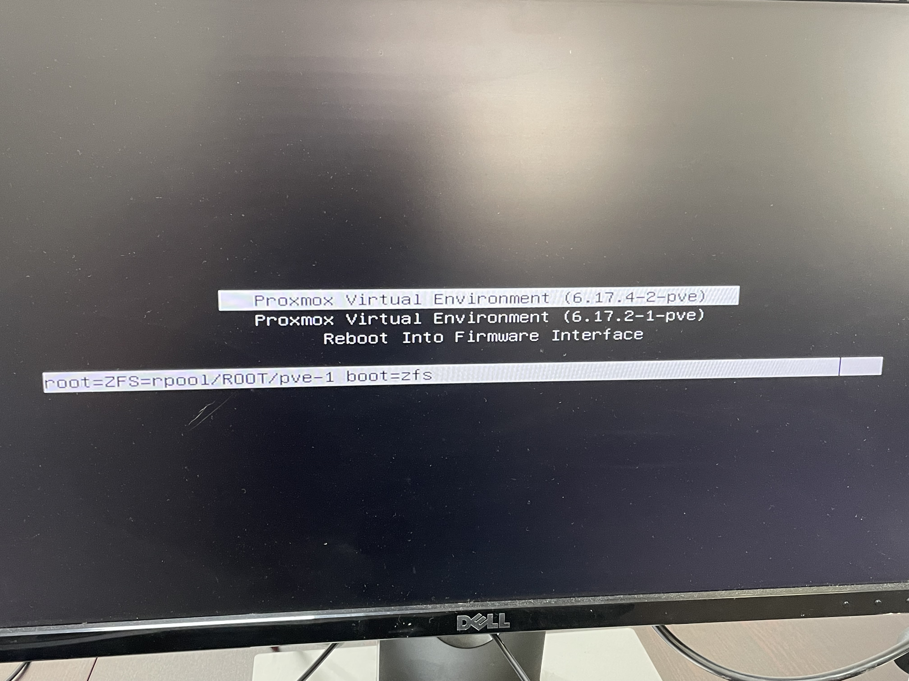
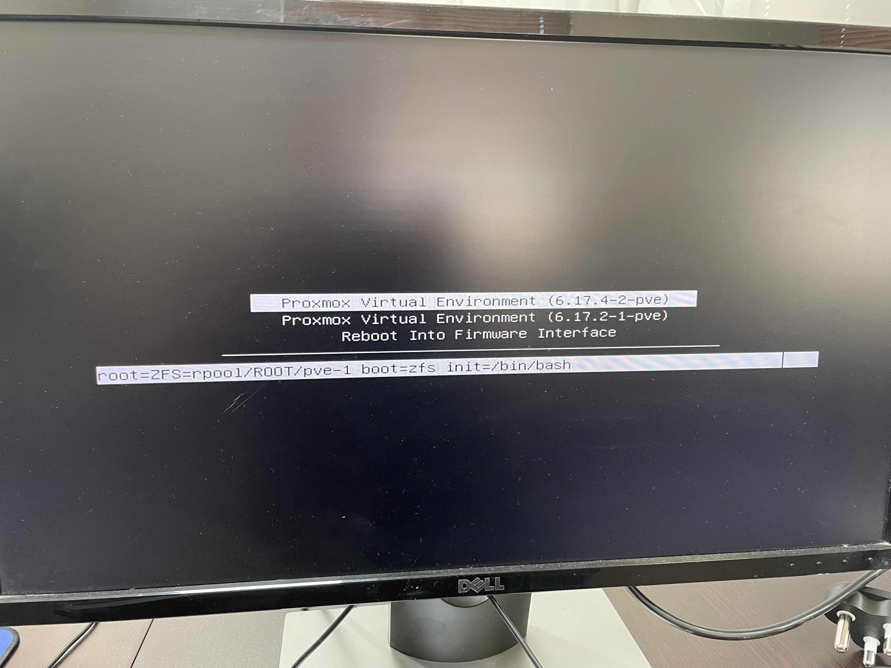

# Reset locked root password

If you find yourself unable to SSH into a PVE node from the root user, you can reet the password.

You'll need to power off the node, either via the physical power button, AHCI power off on the IPMI/BMC, or if you have a second administrator on your cluster.

Power on the node.  When you get to the systemd-boot screen, press ```e``` on your keybaord.  This will allow you to temporarity edit ```/etc/kernel/cmdline```, and pass custom boot parameters.



At the end of the line, add ```init=/bin/bash```, and press enter.



Once booted into bash, you can now run ```passwd``` to change your root password.
